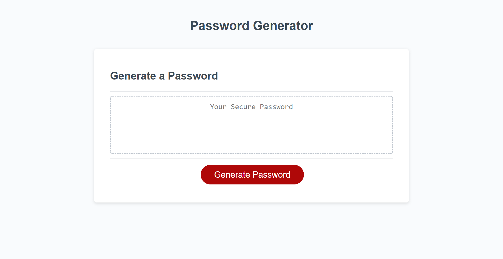

# FunkE Random Password Generator 

## Description

The purpose of this webpage is to assist user in creating a password generated by the computer. The user can choose parameters they would like in their password and the computer will generate a unique password that follows those parameters. This can help users enhance their security throughout their life by recieving a uniques output each time. I was able tp deepen my learning on for loops and functions in JavaScript. I learned I have more skills to gain and will need more practice with JavaScript. I have a hard time over thinking which of my variables connect in what sequcial order. 
- What did you learn?

## Table of Contents

- [Installation](#installation)
- [Usage](#usage)
- [Credits](#credits)
- [License](#license)

## Installation

There is no installation needed. User will only needs to follow uniform resource locator (url). 

## Usage

Once the web browser is open the user will start by clicking the "generate password" button. The browser will display prompts that the user will use to set the criteria they want for their password. After the prompts are finished the webpage will display a password.

    

## Credits

I worked closely Christina Feland, Joseph Rudasill and Tyreal 

- https://github.com/TheWiseSailor
- https://github.com/KCGSWAGG

## License

The last section of a high-quality README file is the license. This lets other developers know what they can and cannot do with your project. If you need help choosing a license, refer to [https://choosealicense.com/](https://choosealicense.com/).

---

🏆 The previous sections are the bare minimum, and your project will ultimately determine the content of this document. You might also want to consider adding the following sections.

## Badges

Badges aren't necessary, per se, but they demonstrate street cred. Badges let other developers know that you know what you're doing. Check out the badges hosted by [shields.io](https://shields.io/). You may not understand what they all represent now, but you will in time.

## Features

If your project has a lot of features, list them here.

## How to Contribute

If you created an application or package and would like other developers to contribute it, you can include guidelines for how to do so. The [Contributor Covenant](https://www.contributor-covenant.org/) is an industry standard, but you can always write your own if you'd prefer.

## Tests

Go the extra mile and write tests for your application. Then provide examples on how to run them here.